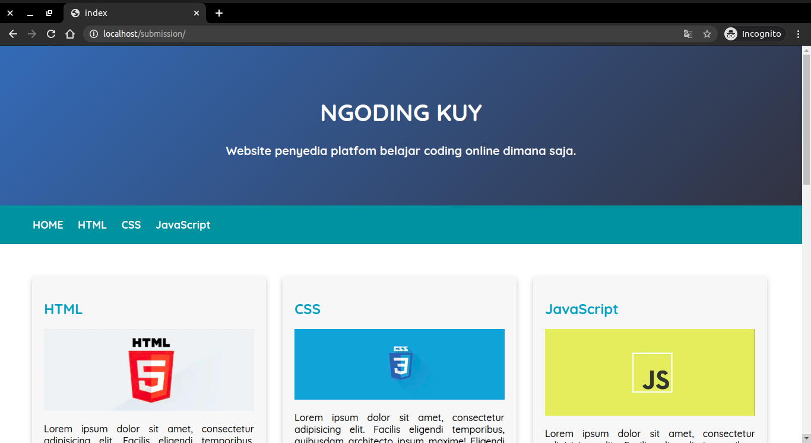
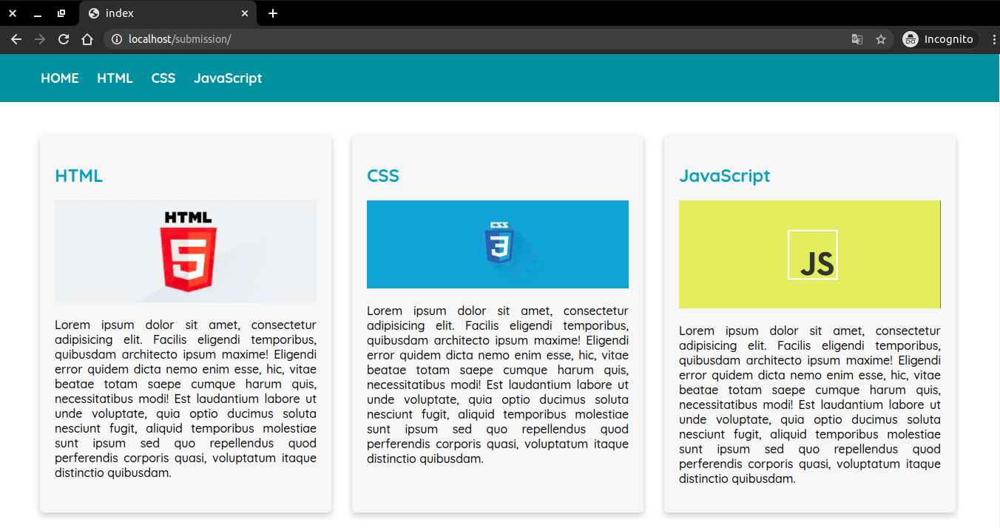
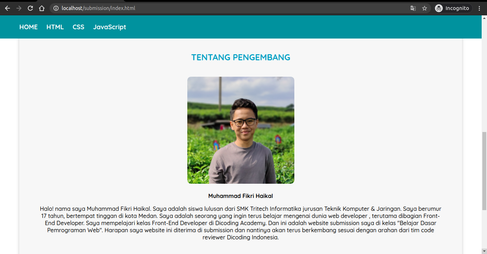

# Submission-Dicoding
Hallo All, 
Ini Submission Kelas <b>"Belajar Dasar Pemrograman Web"</b> Dicoding 
Kalian bisa lihat code ini sebagai referensi untuk penugasan <b>Submission</b> di Dicoding. 

Berikut Priview Web Dasar.  
</img>
  
</img>
  
</img>
  
<b>Terima Kasih!</b>
